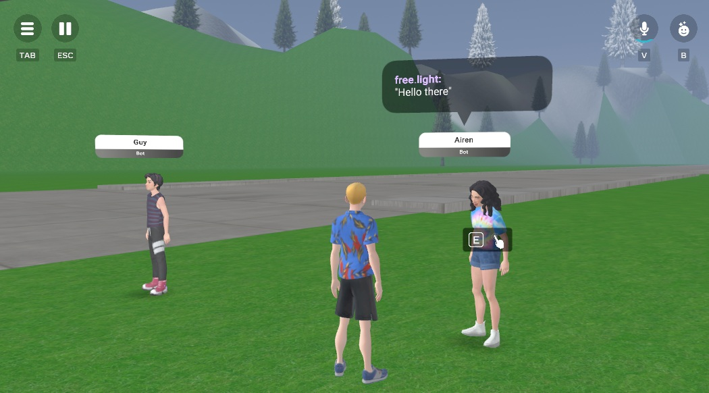
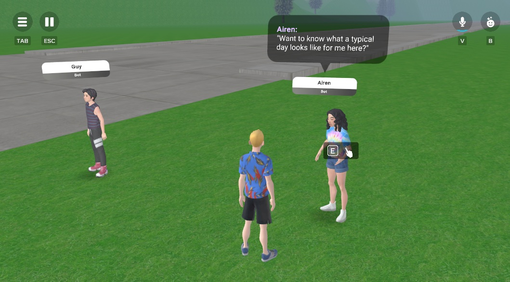
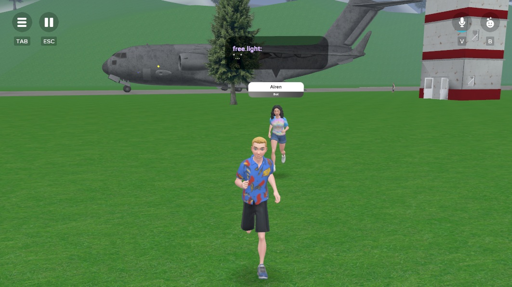

# HZ_NPCFollowConverse

A reusable TypeScript component for **Meta Horizons** that gives your NPCs interactive behavior.  
Attach this script to the root of your NPC and place a **TriggerGizmo** inside (clickable). When clicked, the NPC will:

- **Single click:** Start a conversation with the player.  
- **Double click:** Toggle follow mode — the NPC will follow the player, face them, and maintain a personal space buffer.  
- **Idle behavior:** If no one is interacting, the NPC will wander around its home position.  

This makes it easy to build lively NPCs that can follow players and talk back and forth with them.

---

## Installation

1. Copy the `NPCController` script into your project.  
2. Attach it to the root of your NPC.  
3. Add a **TriggerGizmo** as a child of the NPC.  
4. Configure the public properties as needed.

NOTE: This script's execution mode should be set to 'default, not 'local'

---

## Public Properties

These are the props you can configure on the component:

| Prop             | Type      | Default | Description |
|------------------|-----------|---------|-------------|
| **trigger**      | Entity    | _none_  | The `TriggerGizmo` entity used to detect player clicks. Required. |
| **followDistance** | Number  | `5`     | The distance at which the NPC starts moving toward the player. |
| **personalSpace** | Number   | `2`     | How close the NPC will get to the player before stopping. Keeps NPCs from crowding players. |
| **wanderRadius** | Number   | `5`     | The maximum distance from the NPC’s home position that it will wander when idle. |
| **wanderInterval** | Number | `5000`  | How often (in ms) the NPC picks a new wander destination when idle. |
| **debugMode**     | Boolean | `false` | If enabled, logs debug output (like wander destinations) to the console. |
| **clickThreshold** | Number | `400`   | Time window (in ms) for detecting a double click. Also used to delay single-click responses. |

---

## Behavior Summary

- **Single click on NPC:**  
  NPC listens and responds to the player using the built-in conversation system.

- **Double click on NPC:**  
  Toggles follow mode. NPC will face the player, follow them while maintaining `personalSpace`, and stop following when toggled off.

- **Idle wandering:**  
  When no player is active and follow mode is off, NPC will wander randomly around its original position.

---

# Usage
- Attach this script to the root of an AI NPC, make sure the NPC is setup/configured/etc
- Add a TriggerGizmo as a child to the NPC, and slot it into this script
- Start scene, one click should make the NPC start a conversation with you back and forth via voice/audio, two clicks toggles (on and off) it is follows the clickee-player around the scene or not

## Notes

- The NPC must have **conversation enabled** and an **AI mode** enabled.
- The scene script settings must have horizon/avatar_ai_agent and horizon/npc script API's enabled
- If you want the NPC to stay stationary, set `wanderRadius` to `0`.  
- To customize interactions, extend the `listenAndRespond` method.  

---

## License

MIT — free to use and modify.
